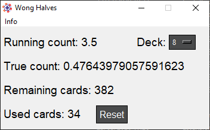

# Wong Halves Card Counting System with Python

Small python card counting program for blackjack with the advanced Wong Halves system.

# Commands for the Running count:
- a: -1
- s: -0.5
- d: 0
- l: +1
- k: +0.5
- j: +1.5

